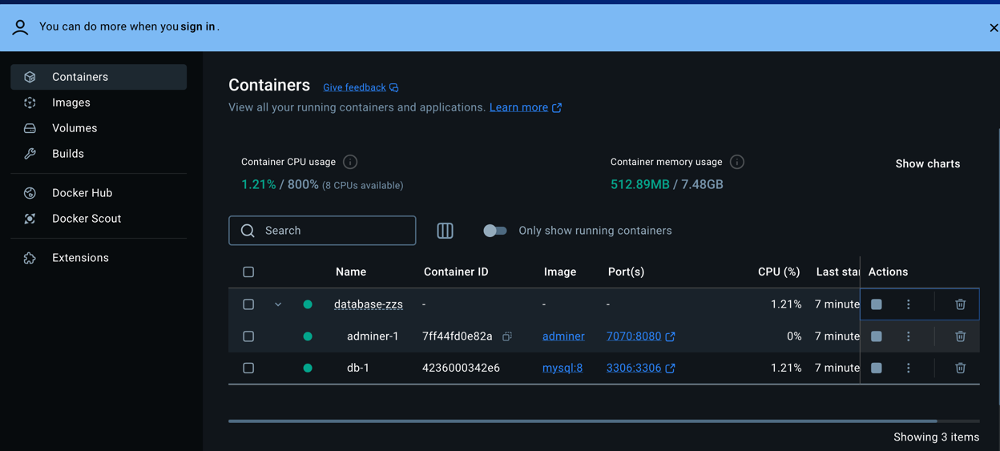

# Django 项目部署指南（基于 Windows + GitHub + MySQL + Docker）

---

## 1. 生成 SSH 密钥并配置 GitHub

1. **生成密钥对（使用你自己的 GitHub 邮箱）**

   ```bash
   ssh-keygen -t rsa -b 4096 -C "your_email@example.com"
   ```

2. **进入密钥目录**

   ```bash
   cd ~/.ssh
   ```

3. **查看公钥内容**

   ```bash
   cat id_rsa.pub
   ```

4. **将公钥复制到 GitHub 的 SSH 设置中**  
   如果不清楚如何操作，可以使用 AI 或百度搜索“GitHub 添加 SSH 密钥”。

---

## 2. 克隆项目

### ✅ 如果已经配置 SSH 密钥

```bash
git clone git@github.com:zhang1003533565/database-zzs.git
```

### ❌ 如果没有配置 SSH 密钥（使用 HTTPS）

```bash
git clone https://github.com/zhang1003533565/database-zzs.git
```

---

## 3. 安装并启动 Docker 容器（MySQL 和 Adminer）

1. **检查 Docker 是否安装**

   ```bash
   docker --version
   ```

2. **启动项目中的容器服务**

   ```bash
   docker compose up
   ```

3. **进入可视化界面 Adminer（MySQL 数据库管理工具）**

   打开浏览器访问：

   ```
   http://localhost:7070
   ```

   示例界面如下：

   

---

## 4. 配置 Python 虚拟环境

1. **创建虚拟环境**

   ```bash
   python -m venv venv
   ```

2. **激活虚拟环境**

   ```bash
   venv\Scripts\activate
   ```

3. **安装依赖**

   ```bash
   pip install -r requirements.txt
   ```

---

## 5. 初始化数据库（可选自动创建数据库）

```bash
python init_db.py
```

---

## 6. 进入 Django 项目并初始化模型

1. **进入项目目录**

   ```bash
   cd myproject
   ```

2. **生成迁移文件**

   ```bash
   python manage.py makemigrations
   ```

3. **迁移数据库**

   ```bash
   python manage.py migrate
   ```

4. **创建超级管理员**

   ```bash
   python manage.py createsuperuser
   ```

   - 用户名：admin  
   - 邮箱：直接回车跳过  
   - 密码：admin123  
   - 如果提示密码过弱，输入 `yes` 确认

---

## 7. 启动 Django 服务

```bash
python manage.py runserver
```

---

## 8. 执行 SQL 插入语句（如有）

你可以在 Adminer 或 Django Shell 中执行自定义 SQL 插入语句，完成数据初始化。

---

✅ 至此，Django 项目部署环境已搭建完毕！


npm install -g @vue/cli
cd frontend
npm install element-plus
npm install axios
npm install vue-router
npm install @element-plus/icons-vue

